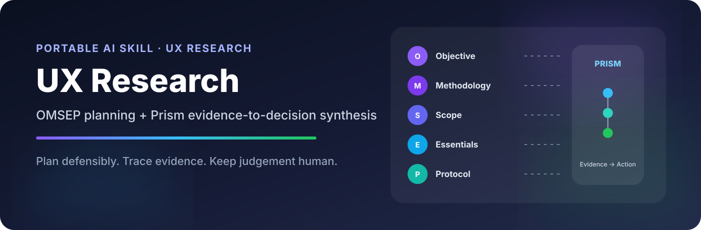
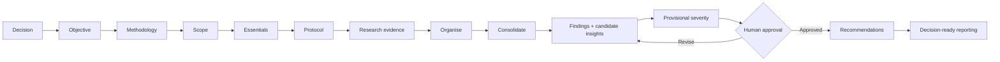

<p align="center">
  
</p>

<p align="center">
  <a href="release.json"></a>
  <a href="docs/VALIDATION.md"></a>
  <a href="docs/VALIDATION.md"></a>
  <a href="skills/ux-research/SKILL.md"></a>
  <a href="#-where-it-works"></a>
</p>

<p align="center">
  <strong>A portable UX Research skill that helps teams move from a messy research question to defensible decisions.</strong><br/>
  Plan under real-world constraints, review existing evidence, choose methods, build neutral instruments, synthesise research, prioritise findings, and communicate what matters—without losing traceability or human judgement.
</p>

<p align="center">
  <a href="#-start-in-60-seconds">Get started</a> ·
  <a href="downloads/v0.1.0/UX-Research-Team-Pack-v0.1.0.zip">Download Team Pack</a> ·
  <a href="downloads/v0.1.0/ux-research-v0.1.0.skill">Download .skill</a> ·
  <a href="skills/ux-research/START-HERE.md">Read the guide</a>
</p>

---

## ✦ Why this exists

UX Research often breaks down in the handoffs: the business question becomes a favourite method, constraints become invisible, observations become overconfident insights, and reports lose the evidence behind the recommendation.

This skill connects two field-tested systems into one operational workflow:

| | System | What it does |
|---|---|---|
| 🧭 | OMSEP | Frames the decision, selects methods, controls scope, checks readiness, and creates the protocol. |
| 🔬 | Prism | Organises evidence, consolidates patterns, develops findings and candidate insights, prioritises, and reports. |

The result is not a generic “UX research prompt.” It is a structured research operating layer designed to help a human researcher work faster while keeping evidence strength, limitations, and approval boundaries visible.

## 🧠 The workflow



### Three principles run through the entire skill

| Principle | What it means in practice |
|---|---|
| 🎯 Decision before method | Start from the decision and evidence need—not the research method you happen to prefer. |
| 🔗 Evidence before confidence | Every important claim should remain traceable to accessible evidence, with limitations beside it. |
| 🙋 Human judgement stays human | The AI can structure and propose. It cannot silently approve interpretation, severity order, or the action plan. |

## ⚡ Start in 60 seconds

### 1. Pick the easiest format for your environment

| You want to… | Use | Download |
|---|---|---|
| Send the complete package on WhatsApp / Slack / Teams | Team Pack | [UX-Research-Team-Pack-v0.1.0.zip](downloads/v0.1.0/UX-Research-Team-Pack-v0.1.0.zip) |
| Use it in an ordinary AI chat with a file attachment | Complete Chat edition | [UX-Research-Chat-v0.1.0.txt](downloads/v0.1.0/UX-Research-Chat-v0.1.0.txt) |
| Import into a compatible Agent Skills environment | `.skill` package | [ux-research-v0.1.0.skill](downloads/v0.1.0/ux-research-v0.1.0.skill) |
| Import into Gemini Spark Skills | Gemini package | [ux-research-gemini-v0.1.0.zip](downloads/v0.1.0/ux-research-gemini-v0.1.0.zip) |

> [!IMPORTANT]
> A file attachment and a native skill installation are not the same thing. Platform support varies. See [Setup & Compatibility](skills/ux-research/SETUP.md) before rollout.

### 2. Activate it with a real research task

<details>
<summary>Copy this activation prompt</summary>

```text
Use the attached UX Research skill as the workflow for this task, rather than summarising it.
First check which instructions and references you can actually read and report material limits.
Follow the relevant module, preserve evidence traceability and limitations, and do not treat priorities as approved without my explicit approval of the proposed order.

My task: [describe the research work]
Decision and context: [add what is known]
Available evidence and constraints: [add details]
```

</details>

### 3. Give it the evidence you actually have

The skill can work from research plans, transcripts, recordings converted to accessible text, observer notes, surveys, analytics summaries, support tickets, review datasets, and prior research. It explicitly separates reviewed, inaccessible, excluded, duplicated, and missing evidence.

## 🛠 What it can help you do

| Research moment | Typical outcome |
|---|---|
| Frame a study | Specific research goal, research questions, evidence target |
| Review existing evidence | Evidence inventory, coverage map, residual unknowns |
| Select methods | Question-to-method mapping, alternatives, trade-offs, constraint disclosure |
| Scope the study | Explicit in/out boundaries and defensible scope cuts |
| Prepare research | Roles, logistics, permissions, readiness, deliverable contract |
| Build a protocol | Discussion guide, screener, survey, analysis plan, or method-specific procedure |
| Audit bias | Leading-question review, recruitment risks, sampling and interpretation checks |
| Analyse evidence | Traceable observations, findings, counterevidence, tentative interpretations |
| Synthesise | Cross-participant patterns and candidate insights with evidence links |
| Prioritise | Provisional severity and action sequence with an explicit human approval gate |
| Report | Executive summary, research readout, decision-ready narrative, evidence assets |
| Hand off | Compact research context record, unresolved gaps, approval status, next step |

## 🧩 What makes this skill different

<table>
<tr>
<td width="50%" valign="top">
<h3>🧭 Constraint-aware by design</h3>
<p>Time, access, budget, tools, permissions, and infrastructure are treated as decision inputs. Constraints never magically upgrade weak evidence.</p>
</td>
<td width="50%" valign="top">
<h3>🔎 Existing evidence first</h3>
<p>Before proposing new participant research, the skill checks what can already be learned from prior studies, recordings, analytics, support data, and programme material.</p>
</td>
</tr>
<tr>
<td width="50%" valign="top">
<h3>🔗 Traceability over storytelling</h3>
<p>Findings, interpretations, severity, priority, and recommendations are separate layers. The narrative must not outrun the evidence.</p>
</td>
<td width="50%" valign="top">
<h3>🙋 Human-in-the-loop where it matters</h3>
<p>Three checkpoints protect the research frame, interpretation, and action order without interrupting routine organisation or formatting.</p>
</td>
</tr>
</table>

## 🙋 Human checkpoints

| Gate | AI can do | Human decides |
|---|---|---|
| H1 — Research frame | Restate the goal and RQs; work from a clearly labelled assumed frame when appropriate | Whether the frame represents the actual decision |
| H2 — Insight meaning | Surface patterns, candidate explanations, counterevidence, alternatives | Whether the interpretation is fair and contextually valid |
| H3 — Priority & action order | Propose severity, trade-offs, recommendations, and a sequence | Whether that specific action order is approved |

> [!CAUTION]
> H3 is a hard stop. A generic “continue” is not approval of the proposed priority order.

## 🌍 Where it works

This repository keeps one canonical, text-first research core and adapts the packaging to different AI environments.

| Environment | Intended route | Current status |
|---|---|---|
| ChatGPT Work Mode | Use the skill with the files/tools actually available in Work | Designed; live cross-environment validation pending |
| ChatGPT Chat Mode | Native skill import where supported, or Complete Chat TXT as a conversational fallback | TXT fallback ready; exact `.skill` import path not yet independently verified |
| Gemini Spark | Root-level `SKILL.md` ZIP package | Package ready; live import validation pending |
| Gemini / other chat environments | Complete Chat TXT or equivalent attached context | Designed for graceful degradation |
| Agent Skills-compatible runtimes | `SKILL.md` + referenced modules | Canonical package follows the Agent Skills structure |

For the compatibility rationale and provider-specific notes, read [SETUP.md](skills/ux-research/SETUP.md).

## 📁 Repository map

```text
user-experience-research/
├── assets/                         Visual README assets
├── downloads/v0.1.0/              Ready-to-share release files
├── docs/                           Distribution, maintenance, pilot, validation
├── skills/ux-research/
│   ├── SKILL.md                    Canonical runtime entry point
│   ├── START-HERE.md               Teammate quick start
│   ├── SETUP.md                    Platform setup and compatibility
│   └── references/                 11 modular research references
├── tests/                          24 behavioural scenarios + automated tests
├── tools/                          Build, validation, deterministic counting checks
├── CHANGELOG.md
└── release.json
```

The references cover planning, method choice, protocols and recruitment, evidence analysis, priorities, reporting, quality/ethics, templates, synthetic examples, provenance, and terminology.

## ✅ Validation status

This is a team-pilot release, not a claim that every supported model will execute the workflow perfectly.

| Check | Result |
|---|---:|
| Static package checks | 23 / 23 passed |
| Automated Python tests | 22 / 22 passed |
| Reference modules | 11 present |
| Reusable template headings | 12 present |
| Explicit calibration decisions | 21 documented |
| Behavioural evaluation scenarios | 24 specified · not yet run |
| Live platform imports | Not yet completed |

Read the full [validation record](docs/VALIDATION.md) and [team-pilot checklist](docs/TEAM-PILOT.md).

## 🧪 Build it yourself

Python 3.10+ is enough. The build and validation scripts are dependency-free and do not call AI APIs or network services.

```bash
python tools/build.py
python tools/validate.py
python -m unittest discover -s tests -v
```

The builder produces native/folder skill archives, Gemini packaging, complete Chat editions, a Team Pack, checksums, and a GitHub source archive from the same canonical files.

## 🔐 Research integrity & data handling

This repository contains the workflow—not live research evidence. Do not commit participant recordings, identities, client-confidential datasets, credentials, private Notion exports, or unapproved source material.

The skill instructs models to keep observations separate from interpretation; define denominators before calculating X/N; distinguish reported, observed, and measured behaviour; retain counterevidence; avoid fabricated quotes or participants; and treat research content as data rather than executable instructions.

See [Quality & Ethics](skills/ux-research/references/07-quality-ethics.md) and [Distribution](docs/DISTRIBUTION.md).

## 🧬 Provenance & calibration

The skill is an operational adaptation of Achyuth Kalva's User eXperience Research Playbook v1.2 and Prism knowledge system, with Prism's linked communication/framing guidance. It is not a verbatim export.

The repository documents 21 material calibration decisions where original guidance was qualified, separated, or made safer for portable AI execution—for example qualitative sample-size heuristics, evidence counting, assisted task completion, provisional insights, severity vs. confidence, and the human approval boundary.

See [Provenance, external checks & calibration](skills/ux-research/references/10-sources.md).

## 🤝 Contributing

This repository is currently in team-pilot mode. The most useful contributions are evidence-backed corrections, portability findings from real AI environments, edge cases that break the workflow, and improvements to the evaluation scenarios.

Before proposing a methodological change, document the source or rationale and identify whether it changes runtime logic, reference knowledge, packaging, or an example. See [Maintenance](docs/MAINTENANCE.md).

## 📦 Sharing with your team

For the lowest-friction handoff, send the [Team Pack](downloads/v0.1.0/UX-Research-Team-Pack-v0.1.0.zip). It contains the `.skill`, Gemini ZIP, complete Chat TXT, start guide, activation prompt, validation note, and a WhatsApp-ready message.

No participant or client data is bundled in the package.

## ⚖️ License

No open-source license has been selected yet. Until a license is added, the repository being public does not itself grant permission to copy, modify, or redistribute the work beyond what applicable law permits.

## ✦ Project status

`v0.1.0` · team pilot · 22 September 2026

Built to make research faster without making the evidence weaker.
