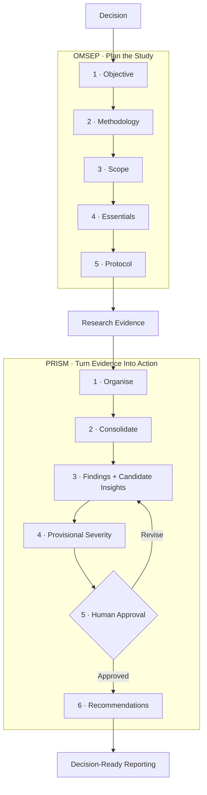

<p align="center">
  
</p>

<p align="center">
  <a href="release.json"></a>
  <a href="docs/VALIDATION.md"></a>
  <a href="docs/VALIDATION.md"></a>
  <a href="skills/ux-research/SKILL.md"></a>
  <a href="#-where-it-works"></a>
</p>

<p align="center">
  <strong>A portable UX Research skill that helps teams move from a messy research question to defensible decisions.</strong><br/>
  Plan under real-world constraints, review existing evidence, choose methods, build neutral instruments, synthesise research, prioritise findings, and communicate what matters.
</p>

<p align="center">
  <a href="#-start-in-60-seconds">Get Started</a> ·
  <a href="https://github.com/achyuthkalva/user-experience-research/archive/refs/heads/main.zip">Download Repository</a> ·
  <a href="skills/ux-research/SKILL.md">View SKILL.md</a> ·
  <a href="skills/ux-research/START-HERE.md">Read the Guide</a>
</p>

---

## ✦ Why This Exists

UX Research often breaks at the handoffs:

- A business question becomes a favourite method.
- Constraints disappear from the final claim.
- Observations become overconfident insights.
- Recommendations lose their evidence trail.

This skill connects two field-tested systems:

| | System | What It Does |
| :--- | :--- | :--- |
| 🧭 | OMSEP | Frames the decision, selects methods, controls scope, checks readiness, and creates the protocol. |
| 🔬 | Prism | Organises evidence, consolidates patterns, develops findings and candidate insights, prioritises, and reports. |

The result is a research operating layer—not a generic “UX research prompt.”

## 🧠 The Workflow

The workflow is deliberately vertical so each stage is easy to scan at normal viewing size.



### Three Principles Run Through the Entire Skill

| Principle | What It Means in Practice |
| :--- | :--- |
| 🎯 Decision before method | Start from the decision and evidence need—not the method you happen to prefer. |
| 🔗 Evidence before confidence | Keep important claims traceable to accessible evidence and limitations. |
| 🙋 Human judgement stays human | AI can structure and propose. It cannot silently approve interpretation, severity order, or the action plan. |

## ⚡ Start in 60 Seconds

### 1. Pick the Easiest Route for Your Environment

| You Want To… | Start Here |
| :--- | :--- |
| Inspect or adapt the canonical skill | [skills/ux-research/](skills/ux-research/) |
| Download everything as one ZIP | [Download the repository](https://github.com/achyuthkalva/user-experience-research/archive/refs/heads/main.zip) |
| Build a `.skill`, Gemini ZIP, Chat TXT, or WhatsApp Team Pack | Run [tools/build.py](tools/build.py) locally |
| Understand platform differences first | [Setup & Compatibility](skills/ux-research/SETUP.md) |

> [!IMPORTANT]
> A file attachment and a native skill installation are not the same thing. Platform support varies. Read [Setup & Compatibility](skills/ux-research/SETUP.md) before rollout.

### 2. Activate It With a Real Research Task

<details>
<summary>Copy this activation prompt</summary>

```text
Use the attached UX Research skill as the workflow for this task, rather than summarising it.
First check which instructions and references you can actually read and report material limits.
Follow the relevant module, preserve evidence traceability and limitations, and do not treat priorities as approved without my explicit approval of the proposed order.

My task: [describe the research work]
Decision and context: [add what is known]
Available evidence and constraints: [add details]
```

</details>

### 3. Give It the Evidence You Actually Have

Useful inputs include:

- Research plans and prior studies
- Transcripts and accessible recording outputs
- Observer notes
- Surveys and analytics summaries
- Support tickets and review datasets
- Product, programme, or operational material

The skill keeps reviewed, inaccessible, excluded, duplicated, and missing evidence separate.

## 🛠 What It Can Help You Do

| Research Moment | Typical Outcome |
| :--- | :--- |
| Frame a study | Specific research goal, research questions, evidence target |
| Review existing evidence | Evidence inventory, coverage map, residual unknowns |
| Select methods | Question-to-method mapping, alternatives, trade-offs, constraint disclosure |
| Scope the study | Explicit in/out boundaries and defensible scope cuts |
| Prepare research | Roles, logistics, permissions, readiness, deliverable contract |
| Build a protocol | Discussion guide, screener, survey, analysis plan, or method-specific procedure |
| Audit bias | Leading-question review, recruitment risks, sampling and interpretation checks |
| Analyse evidence | Traceable observations, findings, counterevidence, tentative interpretations |
| Synthesise | Cross-participant patterns and candidate insights with evidence links |
| Prioritise | Provisional severity and action sequence with an explicit human approval gate |
| Report | Executive summary, research readout, decision-ready narrative, evidence assets |
| Hand off | Compact research context record, unresolved gaps, approval status, next step |

## 🧩 What Makes the Skill Different

- 🧭 **Constraint-aware by design**
  - Time, access, budget, tools, permissions, and infrastructure are decision inputs.
  - Constraints never make weak evidence stronger.

- 🔎 **Existing evidence first**
  - Check prior studies, recordings, analytics, support data, and programme material before recruiting.
  - Add new research only for the uncertainty that remains.

- 🔗 **Traceability over storytelling**
  - Keep findings, interpretations, severity, priority, and recommendations as separate layers.
  - Do not let the narrative outrun the evidence.

- 🙋 **Human-in-the-loop where it matters**
  - Protect the research frame, interpretation, and action order.
  - Avoid unnecessary approval gates for routine organisation or formatting.

## 🙋 Human Checkpoints

| Gate | AI Can Do | Human Decides |
| :--- | :--- | :--- |
| H1 — Research frame | Restate the goal and RQs; use a clearly labelled assumed frame where appropriate | Whether the frame represents the actual decision |
| H2 — Insight meaning | Surface patterns, candidate explanations, counterevidence, and alternatives | Whether the interpretation is fair and contextually valid |
| H3 — Priority & action order | Propose severity, trade-offs, recommendations, and a sequence | Whether that specific action order is approved |

> [!CAUTION]
> H3 is a hard stop. A generic “continue” is not approval of the proposed priority order.

## 🌍 Where It Works

One canonical, text-first research core is packaged differently for each environment.

| Environment | Intended Route | Current Status |
| :--- | :--- | :--- |
| ChatGPT Work Mode | Use the skill with files and tools actually available in Work | Designed; live cross-environment validation pending |
| ChatGPT Chat Mode | Native skill import where supported, or Complete Chat TXT as fallback | TXT fallback ready; exact `.skill` import path not yet independently verified |
| Gemini Spark | Root-level `SKILL.md` ZIP package | Package ready; live import validation pending |
| Gemini / other chat environments | Complete Chat TXT or equivalent attached context | Designed for graceful degradation |
| Agent Skills-compatible runtimes | `SKILL.md` + referenced modules | Canonical package follows the Agent Skills structure |

See [Setup & Compatibility](skills/ux-research/SETUP.md) for provider-specific details.

## 📁 Repository Map

```text
user-experience-research/
├── assets/                         Visual README assets
├── docs/                           Distribution, maintenance, pilot, validation
├── skills/ux-research/
│   ├── SKILL.md                    Canonical runtime entry point
│   ├── START-HERE.md               Teammate quick start
│   ├── SETUP.md                    Platform setup and compatibility
│   └── references/                 11 modular research references
├── tests/                          24 behavioural scenarios + automated tests
├── tools/                          Build, validation, deterministic counting checks
├── CHANGELOG.md
└── release.json
```

Reference modules cover:

- Planning and method choice
- Protocols and recruitment
- Evidence analysis and priorities
- Reporting and quality/ethics
- Templates and synthetic examples
- Provenance and terminology

## ✅ Team Pilot

This release is ready for controlled team use—not yet a claim of universal model reliability.

| Check | Result |
| :--- | :--- |
| Static package checks | 23 / 23 passed |
| Automated Python tests | 22 / 22 passed |
| Reference modules | 11 present |
| Reusable template headings | 12 present |
| Explicit calibration decisions | 21 documented |
| Behavioural evaluation scenarios | 24 specified · not yet run |
| Live platform imports | Not yet completed |

See:

- [Validation Record](docs/VALIDATION.md)
- [Team Pilot Checklist](docs/TEAM-PILOT.md)

## 🧪 Build It Yourself

Requirements:

- Python 3.10+
- No third-party Python dependencies
- No AI API or network calls during the build

Run:

```bash
python tools/build.py
python tools/validate.py
python -m unittest discover -s tests -v
```

The builder creates:

- Native/folder skill archives
- Gemini packaging
- Complete Chat editions
- WhatsApp Team Pack
- Checksums
- GitHub source archive

## 🔐 Research Integrity & Data Handling

Keep live research evidence out of this public repository.

Do not commit:

- Participant recordings or identities
- Client-confidential datasets
- Credentials
- Private Notion exports
- Unapproved source material

The skill also requires:

- Observation and interpretation to remain distinct
- Explicit denominators before X/N calculations
- Reported, observed, and measured behaviour to remain separate
- Counterevidence to stay visible
- No fabricated quotes, participants, or source access
- Research content to be treated as data—not executable instructions

See [Quality & Ethics](skills/ux-research/references/07-quality-ethics.md) and [Distribution](docs/DISTRIBUTION.md).

## 🧬 Provenance & Calibration

The skill adapts:

- Achyuth Kalva's **User eXperience Research Playbook v1.2**
- The **Prism** knowledge system
- Prism's linked communication/framing guidance

It is not a verbatim export.

The repository documents **21 calibration decisions**, including:

- Qualitative sample-size heuristics
- Evidence counting and denominators
- Assisted task completion
- Provisional insights
- Severity vs. confidence
- Human approval boundaries

See [Provenance, External Checks & Calibration](skills/ux-research/references/10-sources.md).

## 🤝 Contributing

The repository is currently in team-pilot mode.

Useful contributions include:

- Evidence-backed methodological corrections
- Portability findings from real AI environments
- Edge cases that break the workflow
- Better evaluation scenarios

Before changing methodology:

1. Document the source or rationale.
2. Identify whether the change affects runtime logic, reference knowledge, packaging, or an example.
3. Follow [Maintenance](docs/MAINTENANCE.md).

## 📦 Sharing With Your Team

For the lowest-friction handoff:

1. Clone or download the repository.
2. Run `python tools/build.py`.
3. Share `dist/UX-Research-Team-Pack-v0.1.0.zip`.

The Team Pack includes:

- `.skill`
- Gemini ZIP
- Complete Chat TXT
- Start guide
- Activation prompt
- Validation note
- WhatsApp-ready message

Generated archives are intentionally excluded from source control. No participant or client data is bundled by the builder.

## ⚖️ License

No open-source license has been selected yet.

Until a license is added, a public repository does not itself grant permission to copy, modify, or redistribute the work beyond what applicable law permits.

## ✦ Project Status

`v0.1.0` · team pilot · 22 September 2026

Built to make research faster without making the evidence weaker.
